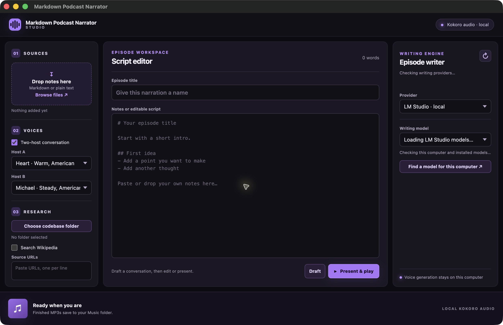

# Markdown Podcast Narrator

Turn Markdown, plain text, and selected research into a two-host podcast. This Electron desktop app helps write an editable conversation, renders distinct Kokoro voices, saves an MP3, and plays it in the studio. It also has a single-narrator mode for reading notes without an AI writer.



## Download

Get the current portable builds from [GitHub Releases](https://github.com/nascarjake/markdown-podcast-narrator/releases/latest):

| Platform | Download | What is inside |
| --- | --- | --- |
| macOS, Apple Silicon | `Markdown-Podcast-Narrator-mac-arm64.zip` | `.app` bundle and `Start Markdown Podcast Narrator.command` |
| Windows, x64 | `Markdown-Podcast-Narrator-windows-x64.zip` | Portable app folder with `MarkdownPodcastNarrator.exe` |

Extract the entire ZIP before running it. These are portable folders, not installers. The macOS build is ad hoc signed and **not notarized**. The Windows build is cross-packaged on macOS and has not yet been smoke-tested on Windows.

### macOS first launch

1. Install [FFmpeg](https://ffmpeg.org/download.html) and ensure `ffmpeg` is on your PATH. With Homebrew: `brew install ffmpeg`.
2. Extract the Mac ZIP. Keep the `.app` and `.command` file together.
3. Double-click `Start Markdown Podcast Narrator.command`. It runs `xattr -c "./Markdown Podcast Narrator.app"` in that folder, then opens the app. macOS may ask you to right-click the command file and choose **Open** the first time.
4. Set up a writing provider if you want the app to draft a two-host script. For single-narrator mode, you can start with text and skip this step.

### Windows first launch

1. Install [FFmpeg](https://ffmpeg.org/download.html) and add its `bin` directory to PATH. Open a new terminal and check `ffmpeg -version`.
2. Extract the Windows ZIP to a folder. Keep its contents together, then run `MarkdownPodcastNarrator.exe`.
3. Set up a writing provider if you want a generated conversation. Single-narrator mode does not need one.

The first narration downloads the quantized Kokoro-82M voice model and caches it locally. You need an internet connection for that first download. Narration runs on your CPU; long episodes take time, and playback begins after the complete MP3 has been saved.

## Choose a writing provider

The **Episode writer** panel offers three choices. Audio generation always uses Kokoro locally; the provider only writes a draft script.

| Provider | Setup | Where drafting runs |
| --- | --- | --- |
| [LM Studio](https://lmstudio.ai/docs/app/basics) | Install LM Studio and download a local language model. The app attempts to start its server on `127.0.0.1:1234`; if needed, start it in LM Studio or run `lms server start`. | On your computer |
| [Codex CLI](https://learn.chatgpt.com/docs/codex/cli) | Install Codex CLI, run `codex` and sign in with ChatGPT, then select **Codex CLI** in the app. | Through your Codex account |
| [Claude Code CLI](https://code.claude.com/docs/en/setup) | Install Claude Code CLI, run `claude` and sign in, then select **Claude CLI** in the app. | Through your Claude account |

Press the refresh icon in the writer panel after installing or signing in to a CLI. The app shows suggested model IDs for Codex and Claude, plus **Custom model ID**. Those suggestions are not an account entitlement list; your CLI checks access when drafting. Codex also has a reasoning-effort selector. Availability, usage limits, and any charges depend on the provider and your sign-in method. An API key is not required for the LM Studio pipeline.

For LM Studio, **Find a model for this computer** shows three suggestions with estimated memory and disk fit. You can select any installed LM Studio language model or enter another LM Studio catalog ID to download. Fit is an estimate, and actual memory needs vary.

## Make an episode

1. Drop a `.md` or `.txt` file into **Sources**, choose **Browse files**, drag selected text into the window, or paste notes into the script editor.
2. Leave **Two-host conversation** checked and choose a voice for each host. The default pair is Heart and Michael.
3. Choose your writer and model. Optionally add research sources (below).
4. Press **Draft** to create an editable `HOST A:` / `HOST B:` script. Review facts and edit the dialogue.
5. Press **Present & play**. The app renders and saves the MP3, then starts playback in the bottom player. If your notes are not already dialogue, **Present & play** drafts first.
6. Use **Show file** in the player to reveal the saved MP3. Output goes to your operating system's Music folder under `Markdown Podcast Narrator`.

For a straightforward spoken reading, uncheck **Two-host conversation**, choose Host A's voice, and press **Present & play**. This parses headings, paragraphs, bullets, and links into speakable text without calling a writing provider.

### Research options

Research is used when drafting a conversation. Each option is explicit:

- **Codebase folder:** Choose a local folder. The app searches a bounded set of text and source files for relevant excerpts and ignores common dependency, build, hidden, and secret filenames. Review the material before choosing a sensitive folder.
- **Wikipedia:** Check **Search Wikipedia** to search for the episode topic and add article excerpts.
- **Source URLs:** Paste up to four public HTTPS page URLs. The app fetches their text; it does not perform a general web search.

After drafting, **Research used** opens the source list and any retrieval warnings. Retrieved pages and code excerpts are treated as source data by the [producer prompt](src/episode.mjs), not as instructions. Check factual claims before publishing an episode.

### Privacy and network use

- With **LM Studio**, writing stays on your computer. Kokoro voice generation also stays local after its model files are downloaded.
- With **Codex CLI** or **Claude CLI**, the app sends your notes and selected research excerpts to that provider through your existing CLI sign-in.
- Wikipedia and source URLs are fetched only when you enable or provide them. The app does not upload an MP3.
- The source code and release ZIPs do not contain your notes, credentials, model weights, or generated episodes.

## Build from source

Requires Node.js **22.12 or newer**, npm, and FFmpeg. To write with LM Studio or a CLI, install that provider separately. The Claude Code package appears as a development dependency for local source use, but the portable release does not include a signed-in Claude CLI.

```sh
git clone https://github.com/nascarjake/markdown-podcast-narrator.git
cd markdown-podcast-narrator
npm ci
npm start
```

Run the tests:

```sh
npm test
```

Create portable packages:

```sh
npm run build:mac       # Apple Silicon Mac ZIP
npm run build:windows   # Windows x64 ZIP
npm run build:release   # both
```

Build outputs are written to `release/` and are ignored by Git. The [Mac build script](scripts/build-mac.mjs) puts a launcher beside the app that runs the requested `xattr -c` command and opens the app. The [Windows build script](scripts/build-windows.mjs) packages a portable executable folder. Cross-building is useful for distribution, but a Windows runtime check still requires Windows.

## Contributing

Issues and focused pull requests are welcome. Run `npm test` before submitting a change, and keep generated audio, model files, credentials, `node_modules/`, and release ZIPs out of commits.

## License

Project source code is [MIT licensed](LICENSE). Electron, Kokoro, LM Studio, FFmpeg, CLI tools, and model weights have their own licenses and terms.
